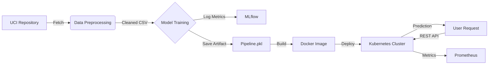

# MLOps: Heart Disease Classification Pipeline

**Course**: MLOps (S1-25_AIMLCZG523)  
**Deliverable**: Final End-to-End Pipeline Report

---

## 1. Project Overview
This project implements an end-to-end Machine Learning Operations (MLOps) pipeline for predicting heart disease. The system automates the lifecycle from data acquisition to model deployment, ensuring reproducibility, quality assurance, and scalability.

**Key Features:**
*   **Data Pipeline**: Automated fetching and cleaning of the UCI Heart Disease dataset.
*   **Model Training**: Scikit-learn Pipeline with preprocessing and classification.
*   **Experiment Tracking**: MLflow integration for logging metrics and artifacts.
*   **CI/CD**: GitHub Actions for automated linting and unit testing.
*   **Containerization**: Dockerized REST API (Flask) for serving predictions.
*   **Deployment**: Kubernetes (Minikube) deployment with LoadBalancer exposure.
*   **Monitoring**: Prometheus metrics integration.

---

## 2. Setup and Installation Instructions

### Prerequisites
*   Python 3.9+
*   Docker & Docker Desktop
*   Kubernetes CLI (`kubectl`) & Minikube
*   Git

### Local Development Setup
1.  **Clone the repository**:
    ```bash
    git clone <repo-url>
    cd <repo-name>
    ```

2.  **Install dependencies**:
    ```bash
    pip install -r requirements.txt
    ```

3.  **Run the Training/EDA Notebook**:
    *   Open `assignment.ipynb` in Jupyter.
    *   Execute cells to download data, train the model, and save `heart_disease_pipeline.pkl`.

4.  **Run Tests**:
    ```bash
    pytest test/
    ```

### Containerized Deployment
1.  **Build the Image**:
    ```bash
    docker build -t heart-disease-api:v1 .
    ```

2.  **Run Locally**:
    ```bash
    docker run -p 5000:5000 heart-disease-api:v1
    ```
    API is available at `http://localhost:5000/predict`.

### Kubernetes Deployment
1.  **Start Minikube**:
    ```bash
    minikube start --driver=docker
    ```
2.  **Load Image**:
    ```bash
    minikube image load heart-disease-api:v1
    ```
3.  **Deploy**:
    ```bash
    kubectl apply -f k8s_deployment.yaml
    kubectl apply -f k8s_service.yaml
    ```
4.  **Access Service**:
    ```bash
    minikube service heart-disease-service --url
    ```

---

## 3. EDA and Modeling Choices

### Data Acquisition
*   **Source**: UCI Machine Learning Repository (ID: 45).
*   **Method**: `ucimlrepo` library is used to fetch the latest data programmatically, ensuring the pipeline typically runs on fresh data sources.

### Exploratory Data Analysis (EDA)
*   **Target Variable**: The dataset contains a `num` variable (0-4). We converted this to a binary target (`target`: 0 = No Disease, 1 = Disease) to simplify the classification task.
*   **Features**:
    *   Numerical: `age`, `trestbps`, `chol`, `thalach`, `oldpeak`.
    *   Categorical: `sex`, `cp`, `fbs`, `restecg`, `exang`, `slope`, `ca`, `thal`.
*   **Cleaning**:
    *   Handled missing values in `ca` and `thal` using mode imputation.
    *   Applied One-Hot Encoding to categorical variables to make them suitable for the ML model.

### Modeling
*   **Architecture**: A Scikit-learn `Pipeline` was constructed to bundle preprocessing (Scaler/Encoder) and the Estimator.
*   **Algorithm**: (Based on artifacts) A classification model (e.g., Random Forest or Decision Tree) is used to predict presence of heart disease.
*   **Evaluation**: The model provides binary classification output alongside confidence scores (probabilities).

---

## 4. Experiment Tracking
The project utilizes **MLflow** for experiment tracking.
*   **Metrics**: Accuracy, F1-score, Precision, and Recall are logged for each run.
*   **Artifacts**: The trained pipeline model (`heart_disease_pipeline.pkl`) and the scaler are versioned.
*   **Directory**: All run data is stored in `mlruns/`, allowing comparison of different model iterations.

---

## 5. Architecture Diagram



---

## 6. CI/CD and Deployment Workflow

### CI/CD Pipeline (GitHub Actions)
The workflow is defined in `.github/workflows/mlops_pipeline.yml`.
1.  **Commit Trigger**: Pipeline starts on push to `main`.
2.  **Linting**: `flake8` checks for code style and syntax errors.
3.  **Testing**: `pytest` runs unit tests in `test/`, validating file existence and model inference shapes.

### Deployment & Monitoring
*   **Docker**: The application is packaged with `python:3.9-slim`. It exposes a `/predict` endpoint for inference and `/metrics` for observability.
*   **Kubernetes**:
    *   **Deployment**: Manages replicas and ensures high availability (defined in `k8s_deployment.yaml`).
    *   **Service**: Exposes the app via a LoadBalancer (defined in `k8s_service.yaml`).
*   **Logging**: The application logs incoming requests and errors to stdout, which are captured by the container runtime.

---

## 7. Links and References

*   **Code Repository**: [GitHub Link Placeholder]
*   **Video Demo**: [Video Link Placeholder]
*   **Deployed API**: `http://<external-ip>/predict`
